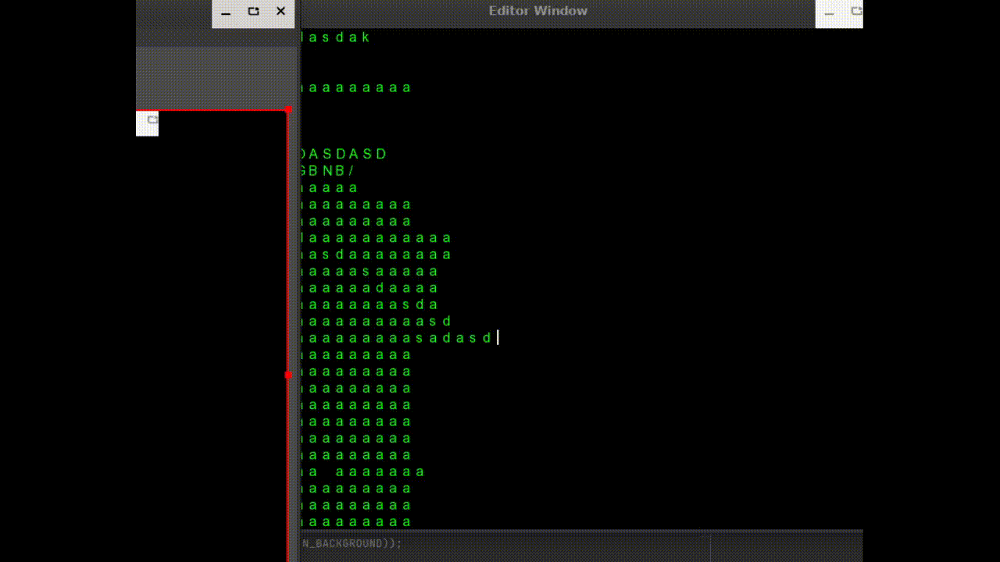

# text-editor
hob project, basic text editor 
basic implementation of sfml

### to do list

/ Screen = done

/ Cursor wasd movement= done

/ Open file = done

/ Cursor Camera Movement = done

/ BackSpace and camera update = done

/ Del and camera update = done

/ Add Enter and camera update = done

/ typing and camera update = done

/ special key codes -> ctrl shift space = done -> save file

/ color and font = done

/ files update = done

### General Brainstorm

**Pseudocode:**

    main loop (while):
        keypress events;
        in response to keypress: (ok look like python :D)
            update event again again
            if quit == quit was pressed;
                exit();
        refresh;
    
### EXTRA NODES 
in InputExample-linux dic, there is a file, it is just a keylogger basically without sfml

### sources
http://www.eel.is/c++draft/#class
https://www.sfml-dev.org/ -> basically most essential
https://man.cx/attribute
https://en.cppreference.com/w/cpp/language/classes
